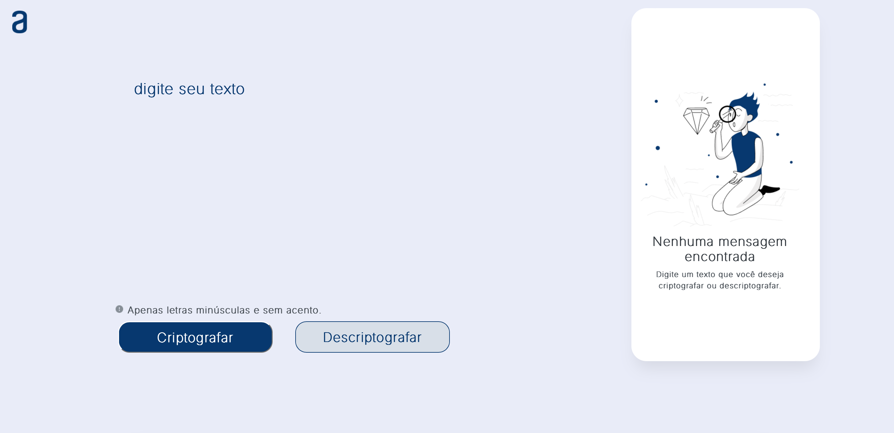

# Decodificador de Texto - Challenge ONE
## Sobre o Projeto
O decodificador de texto é um desafio proposto pelo programa ONE, One Next Education, visando a pratica dos conhecimentos iniciais em programação web. O site possui um campo de entrada de texto, onde o valor inserido poderá ser criptografado ou descriptografado de acordo com a lógica sugerida.

- Decodificador de texto com design responsivo feito em HTML, CSS e JavaScript.

     

As "chaves" de criptografia sugeridas foram:

- A letra **"e"** é convertida para **"enter"**
- A letra **"i"** é convertida para **"imes"**
- A letra **"a"** é convertida para **"ai"**
- A letra **"o"** é convertida para **"ober"**
- A letra **"u"** é convertida para **"ufat"**

Funcionalidade:
---
- Funciona apenas com letras minúsculas
- Não devem ser utilizados letras com acentos nem caracteres especiais, por exlemplo: ponto, vírgula, hastag, arroba, entre outros
- É possível converter uma palavra para a versão criptografada e também retornar uma palavra criptografada para a versão original.

Exemplo:
"gato" => "gaitober"
gaitober" => "gato"

Badge pela Conclusão do Desafio
---
